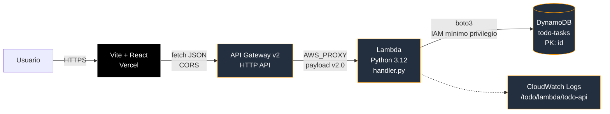
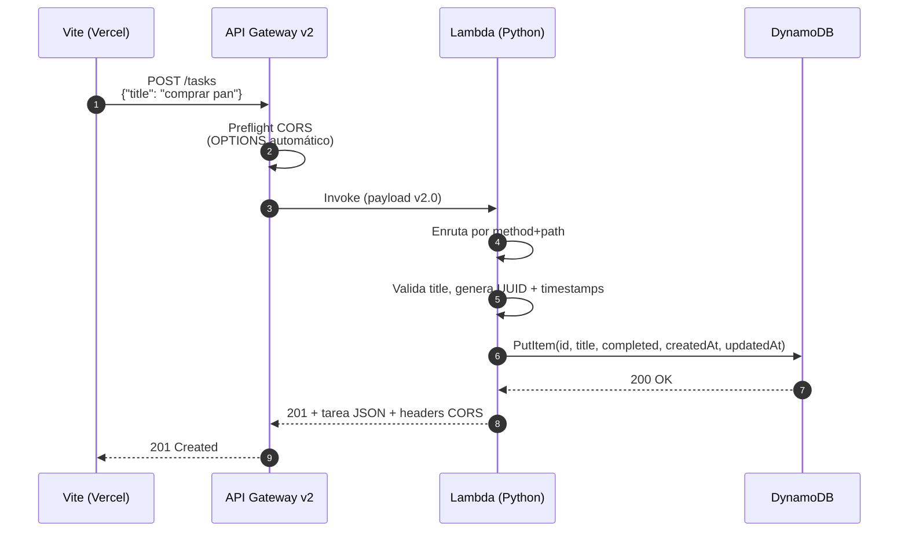

# Arquitectura

Todo List serverless desplegada en AWS (Lambda + DynamoDB) con frontend Vite/React en Vercel. Infraestructura declarada 100% en Terraform.

## Vista general



## Flujo de una petición (ej. `POST /tasks`)



## Recursos AWS

| Recurso | Rol | Config clave |
|---|---|---|
| **Lambda** `todo-api` | Backend único: enruta `method+path` del evento y ejecuta la operación DynamoDB | Python 3.12, 256 MB, timeout 10 s, env `TABLE_NAME` |
| **API Gateway v2** `todo-http-api` | Entrada pública HTTPS con CORS | HTTP API, stage `$default`, 5 rutas CRUD, integración `AWS_PROXY` |
| **DynamoDB** `todo-tasks` | Persistencia de tareas | `PAY_PER_REQUEST`, PK `id` (String), sin GSIs/streams |
| **IAM** `todo-lambda-exec` | Rol de ejecución de la Lambda | `AWSLambdaBasicExecutionRole` + policy inline con 5 acciones DynamoDB sobre el ARN exacto de `todo-tasks` |
| **CloudWatch Logs** `/todo/lambda/todo-api` | Logs de la Lambda | Retención 7 días, enlazado vía `logging_config` (fuera del namespace `/aws/lambda/*`) |

## Modelo de datos

```json
{
  "id": "uuid-v4",
  "title": "string",
  "completed": false,
  "createdAt": "2026-10-05T22:11:08.761736+00:00",
  "updatedAt": "2026-10-05T22:11:08.761736+00:00"
}
```

PK = `id`. Sin índices secundarios — `GET /tasks` usa `Scan` (admisible para listas pequeñas; migrar a GSI por `createdAt` si crece).

## Rutas HTTP

| Método | Path | Handler | DynamoDB |
|---|---|---|---|
| GET | `/tasks` | `list_tasks` | `Scan` |
| POST | `/tasks` | `create_task` | `PutItem` |
| GET | `/tasks/{id}` | `get_task` | `GetItem` (ConsistentRead) |
| PUT | `/tasks/{id}` | `update_task` | `UpdateItem` |
| DELETE | `/tasks/{id}` | `delete_task` | `DeleteItem` |

Todas devuelven JSON con headers `Access-Control-Allow-*: *`.

## Decisiones

- **API Gateway v2 en vez de Function URL.** La Function URL pública de Lambda devolvía `403 Forbidden` por el "Block Public Access" que AWS aplica por defecto a cuentas nuevas (2024). Migrar a HTTP API v2 lo resuelve y además da CORS declarativo.
- **Una sola Lambda, no una por ruta.** El handler enruta internamente (`method + path`). Simplifica despliegue y cold starts. Para una API con >10 endpoints o lógica muy divergente, convendría separar.
- **DynamoDB `PAY_PER_REQUEST`.** Coste proporcional al uso (≈0 € en idle). Evita elegir capacidad y permite picos sin provisioning.
- **IAM de mínimo privilegio.** La policy inline lista las 5 acciones concretas (`PutItem`, `GetItem`, `UpdateItem`, `DeleteItem`, `Scan`) con `resources = [aws_dynamodb_table.tasks.arn]` — nada de `dynamodb:*` ni `Resource: "*"`.
- **Log group custom en `logging_config`.** Fuera del namespace `/aws/lambda/<fn>` que Lambda auto-crea. Permite que `terraform destroy` lo elimine limpiamente sin que Lambda lo recree (ver `terraform/tests/apply.tftest.hcl`).
- **`ConsistentRead=True` en `get_item`.** Para que `GET /tasks/{id}` justo después de un `POST` no devuelva 404 por consistencia eventual.
- **Frontend desacoplado en Vercel.** La única variable de entorno es `VITE_API_URL`. Separación limpia entre hosting estático y backend serverless.

## IaC: estructura de Terraform

```
terraform/
├── providers.tf       aws + archive + default_tags
├── variables.tf       region, profile, project_name, table_name
├── dynamodb.tf        tabla
├── iam.tf             rol + policy mínimo privilegio
├── lambda.tf          zip + function + log group + logging_config
├── apigw.tf           api + integration + 5 routes + stage + permission
├── outputs.tf         api_url, lambda_name, table_name
└── tests/
    ├── validate.tftest.hcl   plan + asserts sobre config
    ├── apply.tftest.hcl      apply + CRUD real + destroy
    ├── cleanup/              pre-apply: borra log groups huérfanos
    └── smoke/                data.http + null_resource (curl PUT/DELETE)
```

## CI/CD (manual)

1. `cd terraform && AWS_PROFILE=jorge-2026 terraform apply -auto-approve`
2. `terraform output -raw api_url` → copiar a `frontend/.env` como `VITE_API_URL`
3. `cd frontend && vercel --prod` (o auto-deploy desde GitHub tras conectar el repo en Vercel)

Para destruir: `cd terraform && terraform destroy -auto-approve`.
